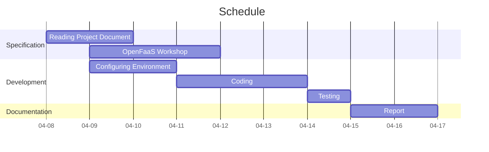

# COMP4651 Project

Deadline: 11:59 pm, May 9 (Sunday)

|Name|Student ID|Email|
|-|-|-|
|Kyler, Tang Chun Yi|2061 9766|cytangao@connect.ust.hk|

---

## Application Description
### Overview
### Architecture
### Classification Model
In this project, we use a deep neunral network model named Connecting Text and Images(CLIP), which is a zero-shot image classifier combining encoded text and images to aim to generalize to correctly predicting objects outside the original training set. In addition, although the model classification performance is proportional to the size of label classes, it will dramatically prolong the computation and response time if we increase the size. Therefore, we use CIFAR-100 for the testing dataset which is a subset of tiny images dataset. It consists of 60,000 testing images and 100 classes, which are suitable for our case to allow us to keep the response time within 20 seconds.

## Implementation Procedures

### Pre-preparation

#### Sign up account
* [Amazon Web Services](https://aws.amazon.com/tw/premiumsupport/knowledge-center/create-and-activate-aws-account/)
* [Docker Hub](https://hub.docker.com/)
* [Google Cloud](https://cloud.google.com/free/)

#### Environment Setup
##### Google Cloud

* [Creating Project](https://cloud.google.com/appengine/docs/standard/nodejs/building-app/creating-project)
* [Enable billing for the project](https://cloud.google.com/billing/docs/how-to/modify-project)

##### Amazon Web Services
* [Create and launch EC2 instance](https://docs.aws.amazon.com/efs/latest/ug/gs-step-one-create-ec2-resources.html)

#### Development Environment
##### Linux Server
* System : `Ubuntu Server 18.04 LTS (HVM),EBS General Purpose (SSD)`
* Instance Type : `t3.micro`
* Volume size : `16 GiB`
##### SSH Client
* Software : Visual Studio Code (1.54)


### Prepare for OpenFaaS

#### Install Docker CE

##### Set up the repository

```
sudo apt-get update

sudo apt-get install \
    apt-transport-https \
    ca-certificates \
    curl \
    gnupg \
    lsb-release
    
curl -fsSL https://download.docker.com/linux/ubuntu/gpg | sudo gpg --dearmor -o /usr/share/keyrings/docker-archive-keyring.gpg

echo \
  "deb [arch=amd64 signed-by=/usr/share/keyrings/docker-archive-keyring.gpg] https://download.docker.com/linux/ubuntu \
  $(lsb_release -cs) stable" | sudo tee /etc/apt/sources.list.d/docker.list > /dev/null
```

##### Install Docker Engine
```
sudo apt-get update
 
sudo apt-get install docker-ce docker-ce-cli containerd.io
```

##### Log into Docker Hub
```
export OPENFAAS_PREFIX="<Docker Hub username>"

sudo docker login
```

#### Install OpenFaas CLI
```
curl -sLSf https://cli.openfaas.com | sudo sh
```

### Set-up OpenFaaS with Kubernetes
#### Install kubectl
```
export VER=$(curl -s https://storage.googleapis.com/kubernetes-release/release/stable.txt)

curl -LO https://storage.googleapis.com/kubernetes-release/release/$VER/bin/linux/amd64/kubectl

chmod +x kubectl

mv kubectl /usr/local/bin/
```
#### Create a remote cluster on Google Kubernetes Engine
##### Install Google Cloud SDK
```
echo "deb [signed-by=/usr/share/keyrings/cloud.google.gpg] https://packages.cloud.google.com/apt cloud-sdk main" | sudo tee -a /etc/apt/sources.list.d/google-cloud-sdk.list

sudo apt-get install apt-transport-https ca-certificates gnupg

curl https://packages.cloud.google.com/apt/doc/apt-key.gpg | sudo apt-key --keyring /usr/share/keyrings/cloud.google.gpg add -

sudo apt-get update && sudo apt-get install google-cloud-sdk
```

##### Configure project
```
gcloud init

gcloud config set project <PROJECT_ID>

gcloud config set compute/region <region>

gcloud config set compute/zone <zone>
```

##### Enable the Kubernetes service
```
gcloud services enable container.googleapis.com
```

##### Install kubectl
```
gcloud components install kubectl
```

##### Create a Kubernetes cluster
```
gcloud container clusters create openfaas \
--zone=<zone> \
--num-nodes=1 \
--machine-type=n1-standard-2 \
--disk-size=30 \
--no-enable-cloud-logging
```

##### Set up credentials for kubectl
```
gcloud container clusters get-credentials openfaas
```

##### Create a cluster admin role binding
```
sudo kubectl create clusterrolebinding "cluster-admin-$(whoami)" \
--clusterrole=cluster-admin \
--user="$(gcloud config get-value core/account)"
```

#### Install OpenFaaS with arkade
##### Install arkade
```
curl -SLsf https://dl.get-arkade.dev/ | sudo sh
```
##### Get external ip
```
sudo kubectl get svc -o wide gateway-external -n openfaas
```
##### Log in
```
export OPENFAAS_URL="<external ip>"

PASSWORD=$(kubectl get secret -n openfaas basic-auth -o jsonpath="{.data.basic-auth-password}" | base64 --decode; echo)

echo -n $PASSWORD | faas-cli login --username admin --password-stdin
```

### Create Functions
#### Clone project repository
*Through HTTPS*
```
cd ~

git clone https://github.com/hkust-comp4651-21S/project-serverless-image-recognizer.git
```

*Through SSH*
* Follow the steps: [Connecting to GitHub with SSH](https://docs.github.com/en/github/authenticating-to-github/connecting-to-github-with-ssh)
```
cd ~

git clone git@github.com:hkust-comp4651-21S/project-serverless-image-recognizer.git
```

#### Create working directories
```
cd ~

mkdir -p project \
   && cd project
   
mkdir frontend backend
```

#### Create front-end interface function
##### Scaffold a Python 3 function
```
cd ~/project/frontend

sudo faas-cli new --lang python3 index --prefix="<docker username>"
```
##### Edit index.yml
```yaml=
version: 1.0
provider:
  name: openfaas
  gateway: http://<external ip>:8080
functions:
  index:
    lang: python3
    handler: ./index
    image: <docker username>/index:latest
    environment:
        content_type: text/html
```

##### Copy front-end documents
```
cd ~/project-serverless-image-recognizer/src/frontend/index/

cp * ~/project/frontend/index/
```
##### Deploy front-end interface function
```
cd ~/project/frontend/

sudo faas-cli up -f index.yml

faas-cli deploy -f index.yml
```
#### Create back-end interface function
##### Scaffold a Python 3(debian) function
```
cd ~/project/backend/

sudo faas-cli new --lang python3-debian clip --prefix="<docker username>"
```
##### Edit clip.yml
```yaml=
version: 1.0
provider:
  name: openfaas
  gateway: http://<external ip>:8080
functions:
  clip:
    lang: python3-debian
    handler: ./clip
    image: <docker username>/clip:latest
  environment:
    read_timeout: "60s"
    write_timeout: "60s"
    exec_timeout: "60s"
```
##### Copy back-end documents
```
cd ~/project-serverless-image-recognizer/src/backend/clip/

cp * ~/project/backend/clip/
```
##### Copy dockerfile template
```
cd ~/project-serverless-image-recognizer/src/backend/template/python3-debian/

cp * ~/project/backend/template/python3-debian/
```
##### Deploy back-end interface function
```
cd ~/project/backend/

sudo faas-cli up -f clip.yml

faas-cli deploy -f clip.yml
```
##### Initialize back-end interface function
```
# ignore any error
echo | faas-cli invoke clip
```
### Test Web Application
1. Open web page on : 
`http://<external ip>:8080/function/index`
2. Click `GET START`
3. Upload an image from `hkust-comp4651-21S/project-serverless-image-recognizer/test/` OR anywhere
4. Test the result
5. Click `GO BACK`
6. Repeat step 2 - step 5 

## Project Timeline

## Appendix
Last Update : 08 - 05 - 2021

A. Ellis, K. Fukuyama, L. Roesler, V. Singh and A. Hey, "openfaas/workshop", GitHub, 2021. [Online]. Available: https://github.com/openfaas/workshop. [Accessed: 09- Apr- 2021].

A. Radford, I. Sutskever, J. Kim, G. Krueger and S. Agarwal, "CLIP: Connecting Text and Images", OpenAI, 2021. [Online]. Available: https://openai.com/blog/clip/. [Accessed: 12- Apr- 2021].

##### tags: `COMP 4651` `4651 Project`


